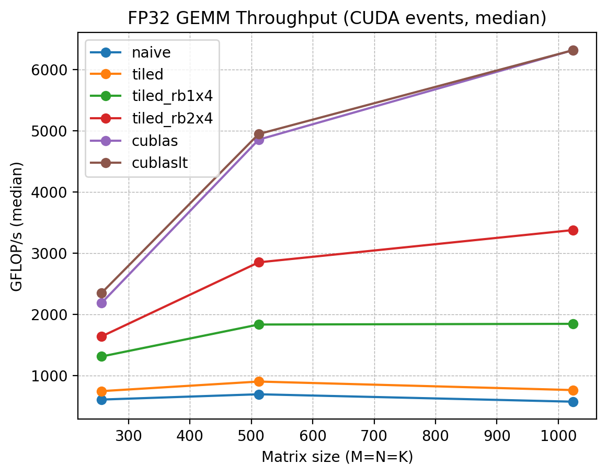
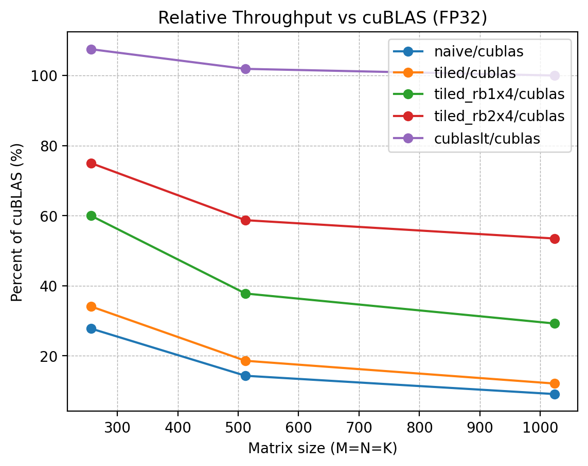
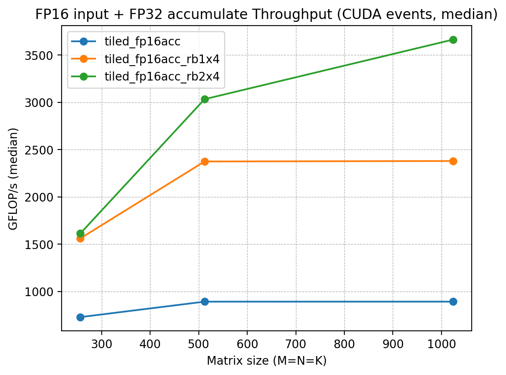
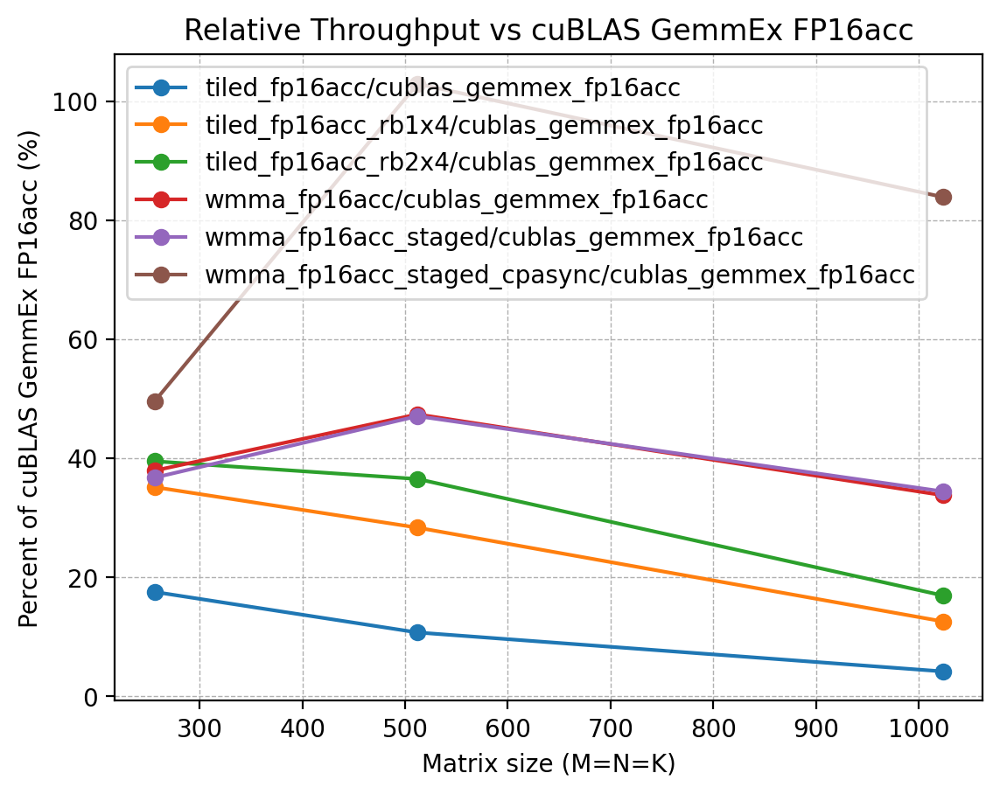

# CUDA GEMM Optimization Practice（FP32 / FP16 / Tensor Core）

## 项目目标

本项目用于练习 CUDA / GPU 性能优化与 profiling，围绕 GEMM（矩阵乘法）实现一条清晰的优化链路，并用 **benchmark 数据 + Nsight Compute 指标**形成可复现实验结论。

目标是从 naive / tiled / register blocking，一路推进到 FP16 / Tensor Core / cuBLASLt baseline
    
## 当前进展

- 搭建 benchmark 框架：参数化 M/N/K，CUDA events 计时，输出 min / median / avg 与 GFLOP/s
- naive GEMM kernel（CPU reference correctness check）
- tiled GEMM kernel（shared memory tiling）
- tiled_rb1x4 GEMM kernel（thread coarsening）
- tiled_rb2x4 GEMM kernel（thread coarsening）
- 接入 cublasSgemm 做 FP32 baseline
- 接入 cublasLt（FP32）做 baseline

- tiled_fp16acc GEMM kernel（FP16 input + FP32 accumulate）
- tiled_fp16acc_rb1x4 GEMM kernel（FP16 input + FP32 accumulate）
- tiled_fp16acc_rb2x4 GEMM kernel（FP16 input + FP32 accumulate）
- wmma_fp16acc（minimal demo）
- 接入 cublas_gemmex_fp16acc 做 FP16 Tensor Core baseline
- 接入 cublaslt_fp16acc 做 FP16 Tensor Core baseline
- 统一口径 batch benchmark / 图表 / NCU 分析 / README 总结
    

## 环境

- GPU: NVIDIA GeForce RTX 4060 Laptop GPU
    
- OS: WSL2 Ubuntu
    
- CUDA: 13.1
    
- Compiler: g++ / nvcc 12.8
    
- Tools: Nsight Compute / Nsight Systems（基础使用）
    


## 目录结构

```text
gemm-fp16/
  src/
    main_bench.cu            # benchmark 入口
    gemm_naive.cu            
    gemm_tiled.cu            
    gemm_tiled_rb1x4.cu      
    gemm_tiled_rb2x4.cu      
    gemm_cublas.cu           
    cublaslt_baseline.cu
    gemm_tiled_fp16acc.cu
    gemm_tiled_fp16acc_rb1x4.cu
    gemm_tiled_fp16acc_rb2x4.cu
    gemm_wmma_fp16acc.cu
    gemm_cublas_gemmex_fp16acc.cu
    cublaslt_fp16acc.cu
    utils.cuh                # 工具函数 / 校验 / 计时辅助
  scripts/
    run_bench.sh             # 批量跑 benchmark
    collect_env.sh           # 导出环境信息
    plot.py                  # 画图脚本
  results/
    raw/                     # 原始结果（日志/CSV）
    plots/                   # 图表
  profiles/
    nsys/                    # Nsight Systems traces
    ncu/                     # Nsight Compute reports
  logs/
```


## 复现方式（Build / Run）

### 1) 构建（WSL2 Ubuntu）

```bash
cd ~/gemm-fp16/build  
cmake ..  
make -j
```

构建产物：`build/bench_gemm`

### 2) 单点运行

下面命令会执行 CPU reference 校验并给出 GFLOP/s（使用 CUDA events 计时）：

```bash
./bench_gemm --impl tiled_rb1x4 --M 256 --N 256 --K 256 --warmup 3 --repeat 10  
./bench_gemm --impl tiled_rb1x4 --M 512 --N 512 --K 512 --warmup 3 --repeat 10
```

### 3) 批量 benchmark

运行脚本（默认 `warmup=3, repeat=10`，对 `256/512/1024` 批量测试当前 `scripts/run_bench.sh` 中配置的全部实现）：

```bash
bash scripts/run_bench.sh
```

脚本输出文件路径与命名规则：

- 输出目录：`results/raw/`
    
- 文件名：`bench_fp32_YYYYmmdd_HHMMSS.txt`  
    例如：`results/raw/bench_fp32_20260225_214132.txt`
    

也可以自定义参数：

```bash
BUILD_DIR=build WARMUP=5 REPEAT=20 bash scripts/run_bench.sh
```


## 实验口径说明

### 1) 性能对比

- 计时方式：CUDA events
    
- `warmup >= 3`，`repeat >= 10`
    
- 使用 **median** 作为稳定性能指标
    
- correctness check：对 CPU reference 做校验（可通过 `--no-check` 关闭，用于纯 profiling 或批量跑更快）
  - FP32 kernels：`atol=1e-3, rtol=1e-3`
  - FP16 input kernels：`atol=2e-2, rtol=2e-2`

### 2) NCU profiling

- NCU 会显著扰动运行时间，因此 **NCU 输出的 ms/GFLOP/s 不用于性能结论**
    
- 建议口径：`--no-check --warmup 0 --repeat 1`（或只看 repeat 对应的那次 kernel launch）
    

## 当前结果

### 表 A：FP32 路线（CUDA events，warmup=3，repeat=10，取 median；全部 correctness PASS）

| Impl            |     256³ |     512³ |      1024³ | 1024³ 相对 cublas |
| --------------- | -------: | -------: | ---------: | ---------------: |
| naive           |  606.815 |  680.148 |    693.506 |           10.98% |
| tiled           |  661.980 |  897.753 |    697.888 |           11.05% |
| tiled_rb1x4     | 1310.720 | 1814.145 |   1860.827 |           29.46% |
| **tiled_rb2x4** | 1489.455 | 2803.679 | **3363.516** |       **53.25%** |
| cublas          | 2048.000 | 4861.552 |   6316.723 |          100.00% |
| cublaslt        | 2048.000 | 4606.594 |   6307.224 |           99.85% |

> cuBLAS baseline：使用 `cublasSgemm`，并通过 row-major→column-major 的等价映射实现 `C = A × B`（row-major 语义），math mode = `CUBLAS_DEFAULT_MATH`。

### 表 B：FP16 / Tensor Core 路线（FP16 input + FP32 accumulate）

| impl                  |     256³ |     512³ |      1024³ | 1024³ 相对 cublas_gemmex_fp16acc |
| --------------------- | -------: | -------: | ---------: | -------------------------------: |
| tiled_fp16acc         |  756.003 |  888.624 |    894.499 |                            5.13% |
| tiled_fp16acc_rb1x4   | 1489.455 | 2372.344 |   2379.072 |                           13.66% |
| tiled_fp16acc_rb2x4   | 1524.093 | 2948.026 |   3669.557 |                           21.06% |
| wmma_fp16acc          | 2048.000 | 4297.443 |   4951.953 |                           28.42% |
| cublas_gemmex_fp16acc | 4228.129 | 9709.037 |  17421.823 |                          100.00% |
| cublaslt_fp16acc      | 3855.059 | 9709.037 |  18396.070 |                          105.59% |


### 可视化（results/plots）

#### FP32




#### FP16 / Tensor Core





    
### Nsight Compute fp32路线瓶颈解释（tiled vs tiled_rb1x4，1024³，profiling-only）

> 说明：下表指标用于解释瓶颈方向，不作为最终性能结论。

| 指标 | tiled | rb1x4 | rb2x4 | 结论/变化解释 |
| :--- | :--- | :--- | :--- | :--- |
| Achieved Occupancy (%) | 98.55 | 79.92 | 63.15 | **tiled -> rb1x4 -> rb2x4**：每线程计算更多输出/寄存器压力更大，occupancy 下降 |
| **Warp Cycles per Issued Instruction (cycle)** | **38.13** | **26.49** | **15.12** |**rb1x4 -> rb2x4**：**下降约 43%**：warp 发指令更紧凑，空转更少 |
| **Stall MIO Throttle (cycles/inst)** | **20.02** | **12.98** | **4.66** |**rb1x4 -> rb2x4**：**显著下降约 64%**：MIO 队列压力减轻，shared/load 等指令相关瓶颈被摊薄 |
| **Stall Barrier (cycles/inst)** | **5.97** | **3.98** | **1.81** |**rb1x4 -> rb2x4**：**下降约 54%**：同步/屏障开销被摊薄（每次加载/同步覆盖更多计算） |
| Compute (SM) Throughput (SOL, %) | 96.67 | 53.63 | 65.88 |**rb1x4 -> rb2x4**：计算侧利用率提高（与更高 GFLOP/s 一致） |
| Memory Throughput (SOL, %) | 96.67 | 74.91 | 86.86 |**rb1x4 -> rb2x4**：rb2x4 更能持续推进内存侧吞吐（更少被 stall 卡住） |

### Nsight Compute：rb1x4 → rb2x4 的瓶颈解释（1024³，profiling-only）
将每线程输出从 1×4 扩展到 2×4（rb2x4）后，Achieved Occupancy 从 **79.92%** 降至 **63.15%**，这是 coarsening/register blocking 增加寄存器与线程资源占用导致的预期 trade-off。但更关键的是，warp-level stall 显著下降：

- Stall MIO Throttle：**12.98 → 4.66 cycles/inst**（约 **-64%**）
    
- Stall Barrier：**3.98 → 1.81 cycles/inst**（约 **-54%**）
    
- Warp Cycles per Issued Instruction：**26.49 → 15.12 cycle**（约 **-43%**）
    
- Memory Throughput（SOL）：**74.91% → 86.86%**；Compute Throughput（SOL）：**53.63% → 65.88%**
    

这说明 rb1x4 仍较多受 MIO 指令队列压力（包含 shared memory 相关指令）与 barrier/sync 开销影响；rb2x4 通过提高每次 tile load / sync 所覆盖的有效计算量，进一步摊薄 shared-load 与同步的固定成本，使 warp 更少处于“发不出下一条指令”的空转状态。对应到稳态 benchmark，rb2x4 在 1024³ 上将吞吐提升到 **3363.516 GFLOP/s**（相对 rb1x4 的 1860.827 GFLOP/s 约 **1.81×**），并达到 cuBLAS 的约 **53.25%**。

### 关键观察与结论

#### 结论 1：在 FP32 路线中，register blocking 明显优于仅 tiled

- `tiled_rb2x4` 在 1024³ 达到 **3363.516 GFLOP/s**
- 相对 `cublas` 达到约 **53.25%**
- NCU 显示性能提升主要来自：
  - `Stall MIO Throttle` 明显下降
  - `Stall Barrier` 明显下降
  - `Warp Cycles per Issued Instruction` 明显下降

说明更强的 coarsening 成功摊薄了 shared-memory / synchronization 开销。
        

#### 结论 2：在 FP16 input + FP32 accumulate（non-TC）路径下，coarsening 仍然显著有效

1024³：

- `tiled_fp16acc`: **894.499 GFLOP/s**
- `tiled_fp16acc_rb1x4`: **2379.072 GFLOP/s**
- `tiled_fp16acc_rb2x4`: **3669.557 GFLOP/s**

说明即使不使用 Tensor Core，数据类型切换并不会改变 shared/sync/issue 开销的本质约束；register blocking 依然是核心优化方向。

#### 结论 3：最小 WMMA demo 已经打通 Tensor Core 路线，但当前主要受数据供给限制

- `wmma_fp16acc` 在 1024³ 达到 **4951.953 GFLOP/s**
- 高于 `tiled_fp16acc_rb2x4` 的 **3669.557 GFLOP/s**，但仍显著低于库级 Tensor Core baseline

NCU 显示：

- `Memory Throughput` 很高
- `Compute Throughput` 仅 **33.85**
- `Stall Long Scoreboard` 高达 **81.53**
- `Warp Cycles per Issued Instruction` 高达 **101.65**

这说明当前 WMMA kernel 的主要问题不是 Tensor Core 本体，而是 **global memory → fragment 的供给效率不足**。

#### 结论 4：库级 FP16 Tensor Core baseline 显著高于当前自写 WMMA demo

1024³：

- `wmma_fp16acc`: **4951.953 GFLOP/s**
- `cublas_gemmex_fp16acc`: **17421.823 GFLOP/s**
- `cublaslt_fp16acc`: **18396.070 GFLOP/s**

这表明当前自写 WMMA 与成熟库实现之间仍有显著差距；下一步若继续优化 Tensor Core 路线，应优先考虑：

- shared-memory staged WMMA
- 更好的 tile / warp mapping
- pipeline / double buffering

### 阶段性总结

目前项目已形成一条较完整的 GEMM 优化路径：

- **FP32 路线**：从 naive / tiled 走到 register blocking（rb1x4 / rb2x4），验证了 coarsening 对 shared-memory、barrier 和 issue 开销的摊薄作用。
- **FP16 non-Tensor-Core 路线**：实现了 FP16 input + FP32 accumulate，并复现了与 FP32 类似的优化规律。
- **Tensor Core 路线**：已完成最小 WMMA demo，并通过 cuBLAS GemmEx / cuBLASLt 建立了 FP16 Tensor Core baseline。

当前结论是：  
对于手写 kernel，单纯“启用 WMMA / Tensor Core”并不足以逼近库级实现；真正的性能上限还取决于数据供给路径、shared-memory staging、warp/block mapping 和 pipeline 设计。


## 下一步计划（短期）

1. 为自写 WMMA kernel 增加 **shared-memory staging**，降低 global memory → fragment 的数据供给开销
2. 继续分析 WMMA kernel 的 NCU 指标，重点关注 `Long Scoreboard`、memory throughput、compute throughput 与 issue 效率
3. 在当前 benchmark / 图表 / README 基础上，整理一版更完整的阶段性实验报告
