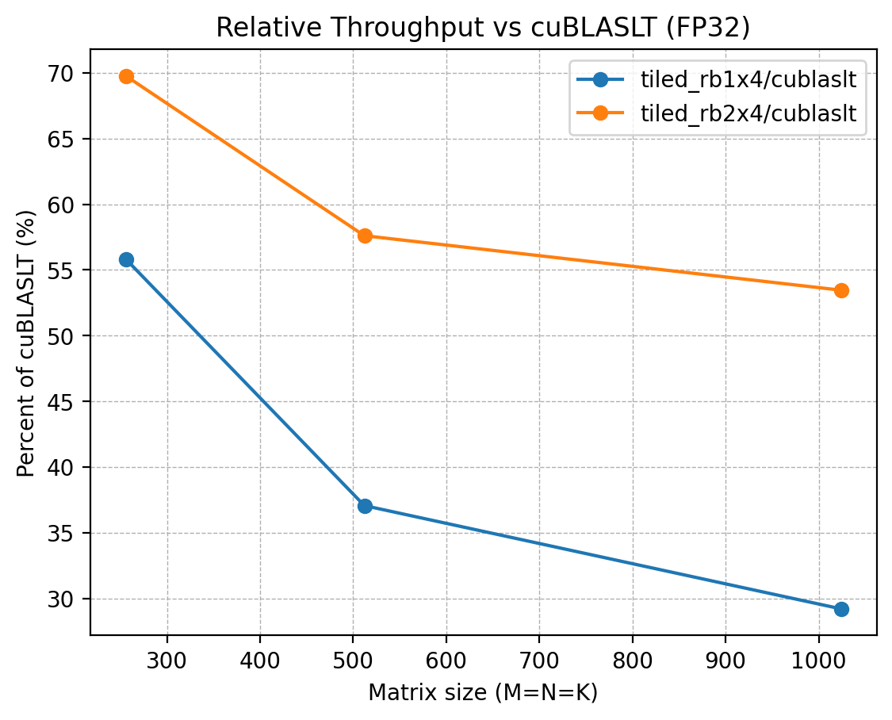
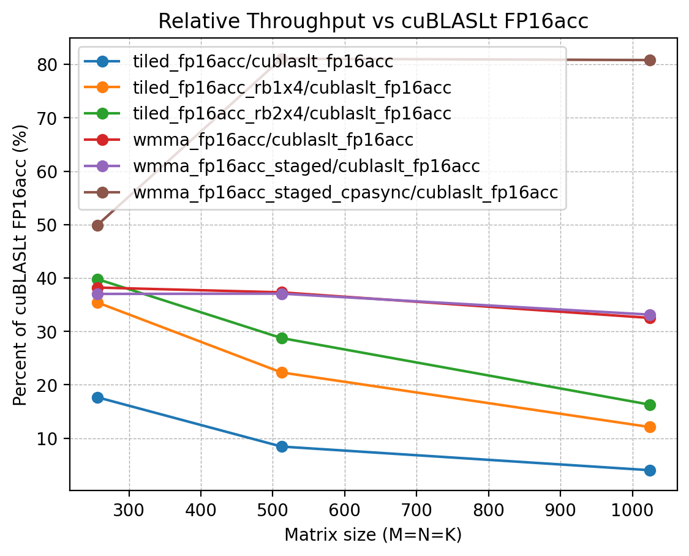

# CUDA GEMM Optimization Practice（FP32 / FP16 / Tensor Core）

## 项目目标

本项目用于练习 CUDA / GPU 性能优化与 profiling，围绕 GEMM（矩阵乘法）实现一条清晰的优化链路，并用 **benchmark 数据 + Nsight Compute 指标**形成可复现实验结论。

目标是从 naive / tiled / register blocking，一路推进到 FP16 / Tensor Core / cuBLASLt baseline。

## 当前进展

- 搭建 benchmark 框架：参数化 M/N/K，CUDA events 计时，输出 min / median / avg 与 GFLOP/s
- naive GEMM kernel（CPU reference correctness check）
- tiled GEMM kernel（shared memory tiling）
- tiled_rb1x4 GEMM kernel（thread coarsening）
- tiled_rb2x4 GEMM kernel（thread coarsening）
- 接入 cublasSgemm 做 FP32 baseline
- 接入 cublasLt（FP32）做 baseline

- tiled_fp16acc GEMM kernel（FP16 input + FP32 accumulate，non-Tensor-Core）
- tiled_fp16acc_rb1x4 GEMM kernel（FP16 input + FP32 accumulate，non-Tensor-Core）
- tiled_fp16acc_rb2x4 GEMM kernel（FP16 input + FP32 accumulate，non-Tensor-Core）

- wmma_fp16acc（minimal demo）
- wmma_fp16acc_staged（shared-memory staged WMMA）
- wmma_fp16acc_staged_cpasync（cp.async 流水化 staged WMMA）

- 接入 cublas_gemmex_fp16acc 做 FP16 Tensor Core baseline
- 接入 cublaslt_fp16acc 做 FP16 Tensor Core baseline
- 统一口径 batch benchmark / 图表 / NCU 分析 / README 总结

## 环境

- GPU: NVIDIA GeForce RTX 4060 Laptop GPU（SM89 / Ada）
- OS: WSL2 Ubuntu
- CUDA Toolkit / nvcc: 12.8（V12.8.93）
- Build: CMake + make
- Tools: Nsight Compute / Nsight Systems

## 目录结构

```text
gemm-fp16/
  src/
    main_bench.cu            # benchmark 入口
    gemm_naive.cu
    gemm_tiled.cu
    gemm_tiled_rb1x4.cu
    gemm_tiled_rb2x4.cu
    gemm_cublas.cu
    cublaslt_baseline.cu

    gemm_tiled_fp16acc.cu
    gemm_tiled_fp16acc_rb1x4.cu
    gemm_tiled_fp16acc_rb2x4.cu

    gemm_wmma_fp16acc.cu
    gemm_wmma_fp16acc_staged.cu
    gemm_wmma_fp16acc_staged_cpasync.cu

    gemm_cublas_gemmex_fp16acc.cu
    cublaslt_fp16acc.cu

    utils.cuh                # 工具函数 / 校验 / 计时辅助
  scripts/
    run_bench.sh             # 批量跑 benchmark
    collect_env.sh           # 导出环境信息
    plot.py                  # 画图脚本
  results/
    raw/                     # 原始结果（日志/CSV）
    plots/                   # 图表
  profiles/
    nsys/                    # Nsight Systems traces
    ncu/                     # Nsight Compute reports
  logs/
```


## 复现方式（Build / Run）

### 1) 构建（WSL2 Ubuntu）

```bash
cd ~/gemm-fp16/build  
cmake ..  
make -j
```

构建产物：`build/bench_gemm`

### 2) 单点运行

下面命令会执行 CPU reference 校验并给出 GFLOP/s（使用 CUDA events 计时）：

```bash
./bench_gemm --impl tiled_rb1x4 --M 256 --N 256 --K 256 --warmup 3 --repeat 10  
./bench_gemm --impl tiled_rb1x4 --M 512 --N 512 --K 512 --warmup 3 --repeat 10
```

### 3) 批量 benchmark

运行脚本（默认 `warmup=3, repeat=10`，对 `256/512/1024` 批量测试当前 `scripts/run_bench.sh` 中配置的全部实现）：

```bash
bash scripts/run_bench.sh
```

脚本输出文件路径与命名规则：

- 输出目录：`results/raw/`
    
- 文件名：`bench_fp16_YYYYmmdd_HHMMSS.txt`  
    例如：`results/raw/bench_fp16_20260225_214132.txt`
    

也可以自定义参数：

```bash
BUILD_DIR=build WARMUP=5 REPEAT=20 bash scripts/run_bench.sh
```


## 实验口径说明

### 1) 性能对比

- 计时方式：CUDA events
    
- `warmup >= 3`，`repeat >= 10`
    
- 使用 **median** 作为稳定性能指标
    
- correctness check：对 CPU reference 做校验（可通过 `--no-check` 关闭，用于纯 profiling 或批量跑更快）
  - FP32 kernels：`atol=1e-3, rtol=1e-3`
  - FP16 input kernels：`atol=2e-2, rtol=2e-2`

### 2) NCU profiling

- NCU 会显著扰动运行时间，因此 **NCU 输出的 ms/GFLOP/s 不用于性能结论**
    
- 建议口径：`--no-check --warmup 0 --repeat 1`（或只看 repeat 对应的那次 kernel launch）
    

## 当前结果
>说明：下表均来自同一轮 run_bench.sh 的 raw 输出文件：
>results/raw/bench_fp16_20260305_165729_wmma_fp16acc_staged_cpasync.txt（warmup=3，repeat=10，取 median；全部 correctness PASS）
### 表 A：FP32 路线

| Impl            |     256³ |     512³ |      1024³ | 1024³ 相对 cublas |
| --------------- | -------: | -------: | ---------: | ---------------: |
| naive           |  606.815 |  680.148 |    693.506 |           10.98% |
| tiled           |  661.980 |  897.753 |    697.888 |           11.05% |
| tiled_rb1x4     | 1310.720 | 1814.145 |   1860.827 |           29.46% |
| **tiled_rb2x4** | 1489.455 | 2803.679 | **3363.516** |       **53.25%** |
| cublas          | 2048.000 | 4861.552 |   6316.723 |          100.00% |
| cublaslt        | 2048.000 | 4606.594 |   6307.224 |           99.85% |

> cuBLAS baseline：使用 `cublasSgemm`，并通过 row-major→column-major 的等价映射实现 `C = A × B`（row-major 语义），math mode = `CUBLAS_DEFAULT_MATH`。

### 表 B：FP16 / Tensor Core 路线（FP16 input + FP32 accumulate）

| impl                        |     256³ |     512³ |      1024³ | 1024³ 相对 cublaslt_fp16acc |
| --------------------------- | -------: | -------: | ---------: | -------------------------------: |
| tiled_fp16acc               |  728.178 |  885.668 |    733.783 |                            4.17% |
| tiled_fp16acc_rb1x4         | 1459.396 | 2340.571 |   2207.528 |                           12.56% |
| tiled_fp16acc_rb2x4         | 1639.681 | 3015.858 |   2972.575 |                           16.91% |
| wmma_fp16acc                | 1574.438 | 3912.597 |   5932.537 |                           33.76% |
| wmma_fp16acc_staged         | 1525.201 | 3887.214 |   6045.027 |                           34.40% |
| **wmma_fp16acc_staged_cpasync** | **2056.031** | **8499.097** | **14734.629** |                       **83.86%** |
| cublaslt_fp16acc                |     4120.141 |    10485.760 |     18236.104 |                        100.00% |


### 可视化（results/plots）

#### FP32


<!--  -->

#### FP16 / Tensor Core




### 关键观察与结论

#### 结论 1：在 FP32 路线中，register blocking 明显优于仅 tiled

- `tiled_rb2x4` 在 1024³ 达到 **3363.516 GFLOP/s**
- 相对 `cublas` 达到约 **53.25%**
- NCU 显示性能提升主要来自：
  - `Stall MIO Throttle` 明显下降
  - `Stall Barrier` 明显下降
  - `Warp Cycles per Issued Instruction` 明显下降

说明更强的 coarsening 成功摊薄了 shared-memory / synchronization 开销。
        

#### 结论 2：在 FP16 input + FP32 accumulate（non-TC）路径下，coarsening 仍然显著有效

1024³：

- `tiled_fp16acc`: **733.783 GFLOP/s**
- `tiled_fp16acc_rb1x4`: **2207.528 GFLOP/s**
- `tiled_fp16acc_rb2x4`: **2972.575 GFLOP/s**

说明即使不使用 Tensor Core，数据类型切换并不会改变 shared/sync/issue 开销的本质约束；register blocking 依然是核心优化方向。

#### 结论 3：WMMA minimal 版本已打通 Tensor Core 路线，但供给路径会成为决定性瓶颈

`wmma_fp16acc`（minimal）在 1024³ 达到 **5932.537 GFLOP/s**，已明显高于 non-TC 的 `tiled_fp16acc_rb2x4`（2972.575 GFLOP/s），说明 Tensor Core 路线可行。但 Nsight Compute 显示 minimal 版本会出现明显的数据供给等待（global → fragment），`Stall Long Scoreboard` 很高，compute 侧利用偏低，性能仍显著落后于库级 Tensor Core baseline。

#### 结论 4：shared-memory staged WMMA 能显著降低供给等待，但提升幅度有限

`wmma_fp16acc_staged` 通过将 A/B tile 先搬运到 shared memory，再由 warp 从 shared memory 加载 fragment，1024³ 吞吐提升到 **6045.027 GFLOP/s**（相对 minimal 小幅提升）。这说明 staged 能有效改善 global 供给相关 stall，但在当前 tile 与同步结构下，性能仍受同步/调度等开销限制，难以逼近库实现。

#### 结论 5：引入 cp.async 的 staged pipeline 后吞吐跃迁到 14+ TFLOP/s，达到库实现 80%+

`wmma_fp16acc_staged_cpasync` 使用 `cp.async` 将 global→shared 搬运异步化，并与 WMMA compute 形成流水重叠。1024³ 上吞吐达到 **14734.629 GFLOP/s**，相对 `cublas_gemmex_fp16acc` 达到 **83.86%**，相对 `cublaslt_fp16acc` 也达到约 **80%+**。Nsight Compute 指标显示 compute 与 memory 吞吐同步提升，`Stall Long Scoreboard` 维持低位，同时 `Stall Barrier` 上升，表明瓶颈开始迁移到同步/调度层面。

### 阶段性总结

目前项目已形成一条较完整的 GEMM 优化路径：

- **FP32 路线**：从 naive / tiled 走到 register blocking（rb1x4 / rb2x4），验证了 coarsening 对 shared-memory、barrier 和 issue 开销的摊薄作用。
- **FP16 non-Tensor-Core 路线**：实现了 FP16 input + FP32 accumulate，并复现了与 FP32 类似的优化规律。
- **Tensor Core 路线**：完成 WMMA 从 minimal → staged → cp.async staged 的结构演进，并与 cuBLAS GemmEx / cuBLASLt 建立 FP16 Tensor Core baseline。

<!-- 当前结论是：  
对于手写 kernel，单纯“启用 WMMA / Tensor Core”并不足以逼近库级实现；想接近库级性能，需要系统性设计数据供给路径（shared-memory staging + pipeline / overlap）。 -->

