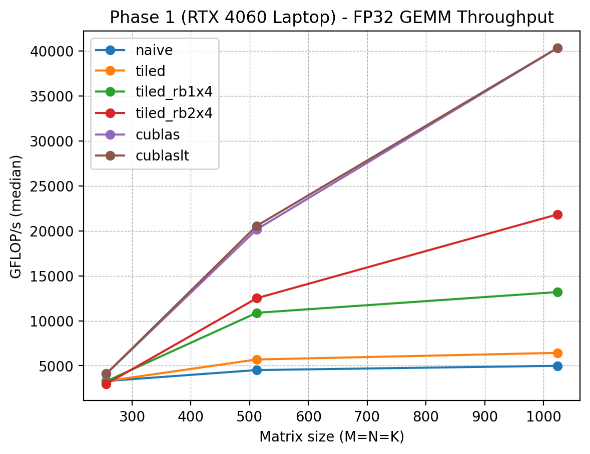
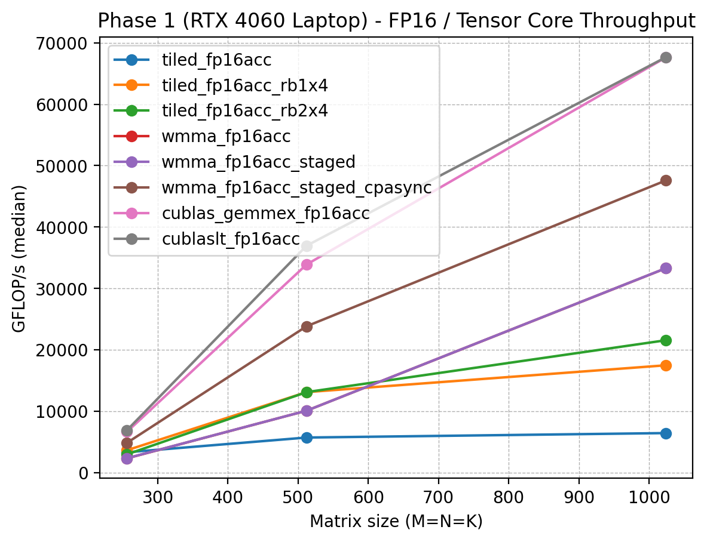
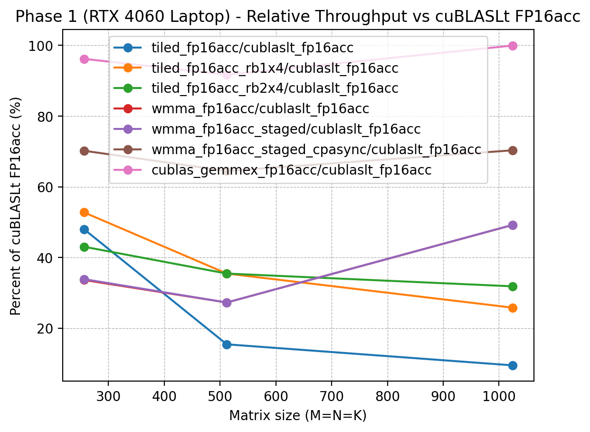
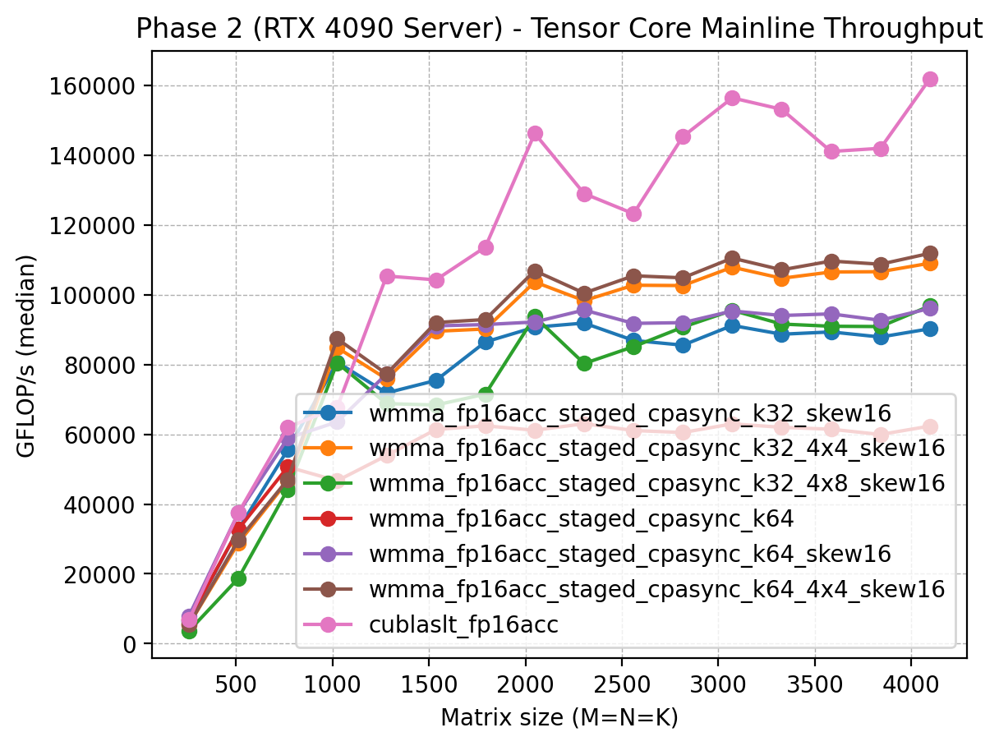
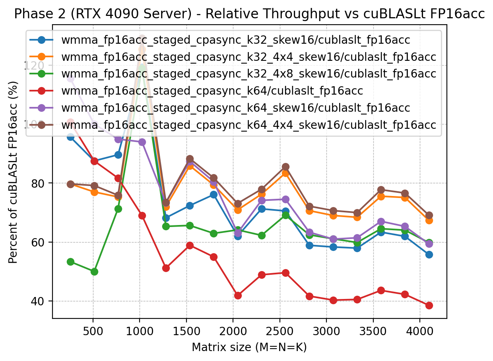

# CUDA GEMM Optimization Practice（FP32 / FP16 / Tensor Core）

## 项目目标

本项目用于练习 CUDA / GPU 性能优化与 profiling，围绕 GEMM（矩阵乘法）实现一条清晰的优化链路，并用 **benchmark 数据 + Nsight Compute 指标**形成可复现实验结论。

项目分成两个阶段：

- **Phase 1（RTX 4060 Laptop / WSL2）**：从 naive / tiled / register blocking，推进到 FP16 / Tensor Core / cuBLASLt baseline，形成完整的入门优化链路。
- **Phase 2（RTX 4090 Server / CUDA 11.8）**：围绕 Tensor Core 主干继续推进，重点优化 `wmma_fp16acc_staged_cpasync` → `k32` → `skew16` 这条 Ada 路线，并与 `cublas_gemmex_fp16acc` / `cublaslt_fp16acc` 做对比。


## 当前进展

### Phase 1（4060）
- 搭建 benchmark 框架：参数化 M/N/K，CUDA events 计时，输出 min / median / avg 与 GFLOP/s
- naive GEMM kernel（CPU reference correctness check）
- tiled GEMM kernel（shared memory tiling）
- tiled_rb1x4 GEMM kernel（thread coarsening）
- tiled_rb2x4 GEMM kernel（thread coarsening）
- 接入 cublasSgemm 做 FP32 baseline
- 接入 cublasLt（FP32）做 baseline
- tiled_fp16acc GEMM kernel（FP16 input + FP32 accumulate，non-Tensor-Core）
- tiled_fp16acc_rb1x4 GEMM kernel（FP16 input + FP32 accumulate，non-Tensor-Core）
- tiled_fp16acc_rb2x4 GEMM kernel（FP16 input + FP32 accumulate，non-Tensor-Core）
- wmma_fp16acc（minimal demo）
- wmma_fp16acc_staged（shared-memory staged WMMA）
- wmma_fp16acc_staged_cpasync（cp.async 流水化 staged WMMA）

### Phase 2（4090）
- 接入 `cublas_gemmex_fp16acc` 与 `cublaslt_fp16acc` 作为 FP16 Tensor Core baseline
- 补齐 `wmma_fp16acc_staged_cpasync_k32`
- 补齐 shared-layout / pitch sweep：
  - `wmma_fp16acc_staged_cpasync_k32_skew16`
  - `wmma_fp16acc_staged_cpasync_k32_skewA16_B8`
  - `wmma_fp16acc_staged_cpasync_k32_skewA8_B16`
- 通过额外 sweep 确认当前最强 custom kernel 仍为：
  - `wmma_fp16acc_staged_cpasync_k32_skew16`
- 已完成 4090 阶段的 Nsight Compute 对比分析：
  - `wmma_fp16acc_staged_cpasync_k32`
  - `wmma_fp16acc_staged_cpasync_k32_skew16`
  - `cublaslt_fp16acc`
- 下一阶段准备从当前 WMMA 路线进一步下沉到更低层的数据通路实现：
  - `src/gemm_mma_ldmatrix_fp16acc_stage2.cu`
  - `impl = mma_ldmatrix_fp16acc_stage2`


## 环境

### Phase 1（RTX 4060 Laptop）
- GPU: NVIDIA GeForce RTX 4060 Laptop GPU（SM89 / Ada）
- OS: WSL2 Ubuntu
- CUDA Toolkit / nvcc: 12.8（V12.8.93）
- Build: CMake + make
- Tools: Nsight Compute / Nsight Systems

### Phase 2（RTX 4090 Server）
- GPU: NVIDIA GeForce RTX 4090（SM89 / Ada）
- OS: Ubuntu（remote server）
- CUDA Toolkit / nvcc: 11.8
- 推荐环境变量：

```bash
export CUDA_HOME=/usr/local/cuda-11.8
export PATH=$CUDA_HOME/bin:$PATH
export LD_LIBRARY_PATH=$CUDA_HOME/lib64:$LD_LIBRARY_PATH
```

- Build: CMake + make
- Tools: Nsight Compute / Nsight Systems


## 目录结构

```text
gemm-fp16/
  src/
    main_bench.cu            # benchmark 入口
    gemm_naive.cu
    gemm_tiled.cu
    gemm_tiled_rb1x4.cu
    gemm_tiled_rb2x4.cu
    gemm_cublas.cu
    cublaslt_baseline.cu

    gemm_tiled_fp16acc.cu
    gemm_tiled_fp16acc_rb1x4.cu
    gemm_tiled_fp16acc_rb2x4.cu

    gemm_wmma_fp16acc.cu
    gemm_wmma_fp16acc_staged.cu
    gemm_wmma_fp16acc_staged_db.cu
    gemm_wmma_fp16acc_staged_cpasync.cu
    gemm_wmma_fp16acc_staged_cpasync_k32.cu
    gemm_wmma_fp16acc_staged_cpasync_k32_bcol.cu
    gemm_wmma_fp16acc_staged_cpasync_k32_4x2.cu
    gemm_wmma_fp16acc_staged_cpasync_k32_split.cu
    gemm_wmma_fp16acc_staged_cpasync_k32_skew16.cu
    gemm_wmma_fp16acc_staged_cpasync_k32_skewA16_B8.cu
    gemm_wmma_fp16acc_staged_cpasync_k32_skewA8_B16.cu

    gemm_cublas_gemmex_fp16acc.cu
    cublaslt_fp16acc.cu

    # 下一阶段（planned）
    gemm_mma_ldmatrix_fp16acc_stage2.cu

    utils.cuh
  scripts/
    run_bench.sh
    collect_env.sh
    plot.py
  results/
    raw/
    plots/
  profiles/
    nsys/
    ncu/
  logs/
```


## 复现方式（Build / Run）

### 1) 构建

#### Phase 1（本地 / WSL2）
```bash
cd ~/gemm-fp16/build
cmake ..
make -j
```

#### Phase 2（4090 server）
```bash
cd ~/gemm-fp16/build
cmake ..
make -j
```

构建产物：`build/bench_gemm`

### 2) 单点运行

```bash
./bench_gemm --impl wmma_fp16acc_staged_cpasync_k32_skew16 --M 1024 --N 1024 --K 1024 --warmup 3 --repeat 10
./bench_gemm --impl wmma_fp16acc_staged_cpasync_k32_skew16 --M 2048 --N 2048 --K 2048 --warmup 3 --repeat 10
```

### 3) 批量 benchmark

#### Phase 1（4060 全链路）
```bash
PROFILE_SET=phase1_4060_all bash scripts/run_bench.sh
```

默认测试：
- 尺寸：`256 / 512 / 1024`
- 实现：Phase 1 全链路（FP32 + FP16 + WMMA early chain）

#### Phase 2（4090 Tensor Core 主线）
```bash
PROFILE_SET=phase2_4090_tc bash scripts/run_bench.sh
```

默认测试：
- 尺寸：`1024 / 2048`
- 实现：
  - `wmma_fp16acc_staged_cpasync`
  - `wmma_fp16acc_staged_cpasync_k32`
  - `wmma_fp16acc_staged_cpasync_k32_skew16`
  - `cublas_gemmex_fp16acc`
  - `cublaslt_fp16acc`

也可以覆盖尺寸：

```bash
PROFILE_SET=phase2_4090_tc SIZES_OVERRIDE="1024 2048" bash scripts/run_bench.sh
```

### 4) 画图

```bash
python3 scripts/plot.py
```

输出图表：

- `results/plots/gflops_phase1_fp32.png`
- `results/plots/gflops_phase1_fp16.png`
- `results/plots/rel_to_cublaslt_phase1_fp16.png`
- `results/plots/gflops_phase2_4090_tc.png`
- `results/plots/rel_to_cublaslt_phase2_4090_tc.png`


## 实验口径说明

### 1) 性能对比
- 计时方式：CUDA events
- `warmup >= 3`，`repeat >= 10`
- 使用 **median** 作为稳定性能指标
- correctness check：默认对 CPU reference 做校验
  - FP32 kernels：`atol=1e-3, rtol=1e-3`
  - FP16 input kernels：`atol=2e-2, rtol=2e-2`

### 2) NCU profiling
- NCU 会显著扰动运行时间，因此 **NCU 输出的 ms/GFLOP/s 不用于最终性能结论**
- 建议口径：

```bash
ncu --set full --target-processes all --force-overwrite \
./build/bench_gemm --impl <impl> --M 2048 --N 2048 --K 2048 --warmup 0 --repeat 1 --no-check
```

## 当前结果

### Phase 1 — RTX 4060 Laptop（完整优化链路）

> Phase 1 使用 4060 Laptop + WSL2 环境，主要目的是把从 FP32 / non-TC 到 WMMA / cp.async 的完整优化链条跑通。该阶段结果不与 4090 阶段混图展示。

#### 表 A：FP32 路线（4060）

| Impl            |     256³ |     512³ |   1024³ | 1024³ 相对 cublas |
| --------------- | -------: | -------: | ------: | ----------------: |
| naive           |  606.815 |  680.148 |  693.506 |            10.98% |
| tiled           |  661.980 |  897.753 |  697.888 |            11.05% |
| tiled_rb1x4     | 1310.720 | 1814.145 | 1860.827 |            29.46% |
| **tiled_rb2x4** | 1489.455 | 2803.679 | **3363.516** |     **53.25%** |
| cublas          | 2048.000 | 4861.552 | 6316.723 |           100.00% |
| cublaslt        | 2048.000 | 4606.594 | 6307.224 |            99.85% |

#### 表 B：FP16 / Tensor Core 路线（4060）

| impl                              |     256³ |     512³ |    1024³ | 1024³ 相对 cublaslt_fp16acc |
| --------------------------------- | -------: | -------: | --------: | ---------------------------: |
| tiled_fp16acc                     |  728.178 |  885.668 |   733.783 |                        4.17% |
| tiled_fp16acc_rb1x4               | 1459.396 | 2340.571 |  2207.528 |                       12.56% |
| tiled_fp16acc_rb2x4               | 1639.681 | 3015.858 |  2972.575 |                       16.91% |
| wmma_fp16acc                      | 1574.438 | 3912.597 |  5932.537 |                       33.76% |
| wmma_fp16acc_staged               | 1525.201 | 3887.214 |  6045.027 |                       34.40% |
| **wmma_fp16acc_staged_cpasync**   | **2056.031** | **8499.097** | **14734.629** |               **80%+** |
| cublaslt_fp16acc                  | 4120.141 | 10485.760 | 18236.104 |                      100.00% |

> Phase 1 的主结论是：  
> register blocking 在 FP32 / non-TC 路线上都有效；而在 Tensor Core 路线上，真正决定性能上限的是数据供给路径，单纯 WMMA minimal 不足以接近库实现，引入 staged + cp.async 后才出现显著跃迁。该阶段原始 README 与图表主要记录的是这条完整教学式优化链路。 

#### Phase 1 图表







### Phase 2 — RTX 4090 Server（Tensor Core 主线推进）

> Phase 2 使用 4090 server + CUDA 11.8，目标不再是重复 Phase 1 的全链路，而是只围绕 Tensor Core 主干继续推进，因此不再更新早期 FP32 / non-Tensor-Core kernels。

#### Phase 2 主测试集合
- `wmma_fp16acc_staged_cpasync_k32_skew16`
- `wmma_fp16acc_staged_cpasync_k32_4x4_skew16`
- `wmma_fp16acc_staged_cpasync_k32_4x8_skew16`
- `wmma_fp16acc_staged_cpasync_k64_skew16`
- `wmma_fp16acc_staged_cpasync_k64_4x4_skew16`
- `cublaslt_fp16acc`

#### Phase 2 图表




#### 全尺寸 sweep 的阶段性结论
- `wmma_fp16acc_staged_cpasync_k32_skew16` 不再是“吃全尺寸”的唯一主干；它在 `1024` 上仍强，但在更大尺寸上开始显露颓势。
- `wmma_fp16acc_staged_cpasync_k64_skew16` 在 **256 / 512 / 768** 三个小尺寸上表现最好，说明 **K-depth 从 32 提到 64** 这条线在 small-shape 上是有效杠杆。
- `wmma_fp16acc_staged_cpasync_k64_4x4_skew16` 从 **1024 一直到 4096** 持续成为 custom kernel 中的最佳版本，说明对于 large-shape，单纯 `k64` 还不够，必须与更大的 CTA tile 一起结合，收益才稳定。
- `wmma_fp16acc_staged_cpasync_k32_4x8_skew16` 明显不如 `k32_4x4_skew16` / `k64_4x4_skew16`，说明 **tile 继续做大并不会自动变强**，仍然受到资源占用、调度与 memory-side 行为的共同约束。
- 与 `cublaslt_fp16acc` 的对比上：
  - `k32_skew16` 只在 `1024` 这一点超过当前仓库口径的 `cublaslt_fp16acc` baseline；
  - `k64_skew16` 在 `256 / 512 / 1024` 上都超过了当前仓库口径的 `cublaslt_fp16acc` baseline；
  - `k64_4x4_skew16` 在大尺寸上相对 `k32_skew16` 有系统性提升，但仍未在大方阵上逼近 vendor 真正的强实现。

## 4090 Profiling 结论

### 1) `skew16` 相对 `k32` 的提升是真实的

在旧主线对照中，`skew16` 相比 `k32` 可以同时改善：

- warp readiness
- issue continuity
- barrier 相关 stall
- memory feed

这说明 `skew16` 的收益不是 benchmark 偶然波动，而是确实改变了 kernel 的执行状态。

### 2) `k64` 的收益不能简单解释成“调度更顺”

在 `1024` 与 `4096` 的新一轮 Nsight Compute 摘要对照中：

- `wmma_fp16acc_staged_cpasync_k64_skew16` 的 `Eligible Warps / Scheduler`、`Issued Warp / Scheduler` 并没有优于 `k32_skew16`；
- 因此它在 small-shape 上的收益，更合理的解释是：
  - **减少了 K-loop 次数**
  - **降低了循环 / 同步 / 控制开销**

也就是说，`k64` 的优势更偏向 loop-structure 层，而不是 scheduler-level issue 连续性层。

### 3) `k64_4x4_skew16` 的收益也不能简化成“更好的 issue 指标”

虽然 `k64_4x4_skew16` 在大尺寸上成为新 winner，但它并不是靠单纯更高的 issue efficiency 获胜。更合理的工程解释是：

- 更大的 CTA tile / block output tile
- 更少的 block 数
- 更低的寄存器数（48 vs 56）
- K64 带来的 loop 次数减少
- 在 large-shape 上重新平衡了工作组织与资源使用

因此，`k64_4x4_skew16` 的收益更像 **大 tile + K64 + resource organization rebalance**，而不是单一的 scheduler-level 改善。

### 4) `k32_skew16` 与 `k64_4x4_skew16` 在 4096 上的 stall 对照

补充的 `WarpStateStats + SourceCounters` 显示：

- `k32_skew16 @ 4096`：
  - `Warp Cycles / Issued Instruction = 22.26`
  - CTA barrier stall ≈ `8.6 cycles`（约 `38.4%`）
  - shared excessive wavefronts 占比约 `50%`
- `k64_4x4_skew16 @ 4096`：
  - `Warp Cycles / Issued Instruction = 28.42`
  - shared excessive wavefronts 占比约 `49%`

这进一步说明：

- `k64_4x4_skew16` 的收益并不是来自“shared wavefronts 显著更干净”；
- `k32_skew16` 的一个核心痛点是 CTA barrier stall 很重；
- `k64_4x4_skew16` 的改善更可能来自 loop / tile / workload organization 的重新平衡，而不是 shared-access 指标单点变优。

### 5) `cublaslt_fp16acc` 的 operating point 与 custom kernel 完全不同

`cublaslt_fp16acc` 在 `1024` / `4096` 上表现出非常不同的资源使用模式：

- 更高的寄存器压力（如 `230+ regs/thread`）
- 更低的 occupancy / active warps
- 更强的 math-pipeline-dominated stall 特征

因此，当前 custom kernel 与 vendor 的差距，不能简单归因于某一个 shared-layout、某一个 block shape 或某一个 scheduler 指标，而更像是：

> vendor 已经把 kernel 推向一种更深的 tensor-pipeline-dominated regime，而当前 custom kernel 仍主要停留在 CTA barrier、memory-side pressure 与 warp readiness 主导的 regime。


## 当前最佳 kernel

当前最强 custom kernel：

- 文件：`src/gemm_wmma_fp16acc_staged_cpasync_k64_4x4_skew16.cu`
- impl：`wmma_fp16acc_staged_cpasync_k64_4x4_skew16`

当前定位：

- 它已经是本仓库在 4090 上的 best custom kernel 候选主干
- 它不是最终答案，也不意味着已经整体超越 cublasLt
- 它证明了 shared-layout sweet spot 的有效性，同时也证明了继续简单 sweep pitch 并不能自动把大方阵拉近到 cublasLt 的实现层级


## 下一步

当前最值得继续推进的方向不是再做大量盲 sweep，而是：

1. 围绕 `wmma_fp16acc_staged_cpasync_k64_4x4_skew16` 做更针对性的 source-level stall 定位；
2. 进一步解释大尺寸上到底是 barrier、shared-access、还是更深层的数据通路限制了继续逼近 vendor；
3. 在保持现有 benchmark / profiling 口径不变的前提下，逐步从当前 WMMA 路线下沉到更低层的数据通路实现。
